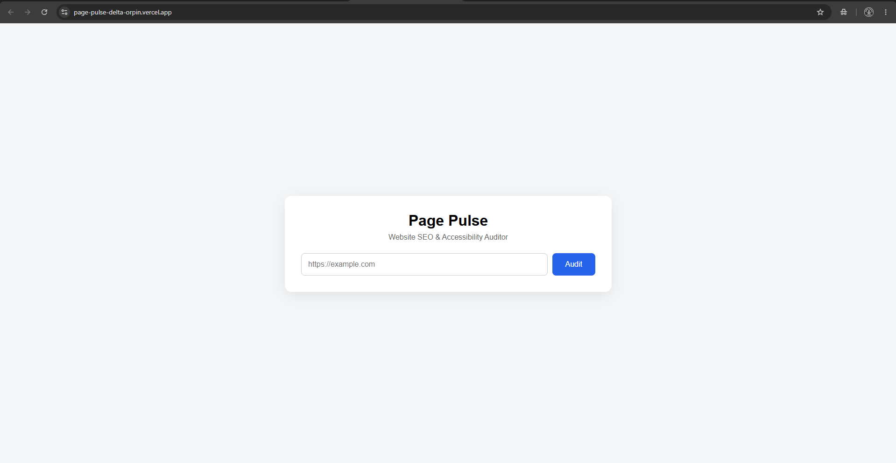
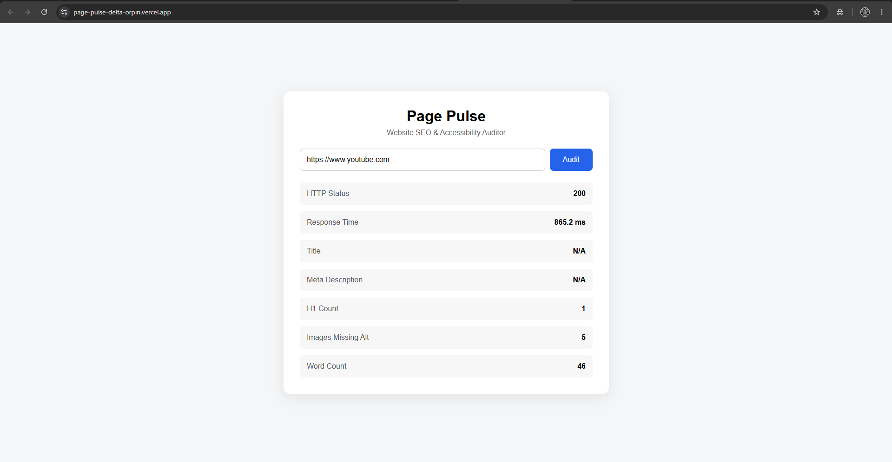

<!--
Page Pulse: README
Generated: 2026-07-25
-->

# Page Pulse


Lightweight web application that audits publicly accessible websites and extracts SEO and accessibility metrics. The frontend accepts a URL and the FastAPI backend fetches the page, parses HTML, and returns structured metrics.

---

## Features

- ✅ URL validation (request schema + 422 responses)
- ✅ Async HTTP fetches with `httpx` and automatic redirect handling
- ✅ Response time measurement (ms)
- ✅ Content-Type validation for HTML (415)
- ✅ Page title extraction
- ✅ Meta description extraction
- ✅ H1 count
- ✅ Images missing `alt` attribute count
- ✅ Visible word count
- ✅ Proper HTTP error handling (422, 415, 502, 504)
- ✅ Swagger / OpenAPI docs (FastAPI)
- ✅ Responsive static frontend (HTML/CSS/Vanilla JS)
- ✅ Unit tests for parsing logic (`pytest`)

---

## Architecture

User
↓
Frontend (static HTML/JS) — submits `POST /audit`
↓
FastAPI API (`backend/app/routes.py`)
↓
Async HTTP Fetch (`httpx`) — handles redirects & measures timing
↓
BeautifulSoup parser (`backend/app/services/audit.py`) — extracts metrics
↓
JSON Response

---

## Screenshots





---

## Project Structure

```
backend/
    app/
        services/
            audit.py
        tests/
            test_audit.py
        main.py
        routes.py
        schemas.py

frontend/
    index.html
    styles.css
    script.js

context.md
README.md
```

---

## Installation

This project uses `uv` as the example package manager. Adjust commands if you use `pip` or `poetry`.

1. Install dependencies and sync the virtual environment:

```bash
uv sync
```

2. Install backend dependencies (alternative if you prefer a local venv):

```powershell
cd backend
python -m venv .venv
.venv\Scripts\Activate.ps1
pip install -r requirements.txt
```

---

## Run (Development)

Start the backend with automatic reload:

```bash
uv run uvicorn app.main:app --reload
```

Serve the static frontend (simple local server):

```bash
cd frontend
python -m http.server 5500
# then open http://localhost:5500
```

---

## API Usage

POST /audit

Request body (JSON):

```json
{
  "url": "https://example.com"
}
```

Example response:

```json
{
  "url": "https://example.com",
  "status": 200,
  "response_time_ms": 153.42,
  "title": "Example Domain",
  "meta_description": "Example description",
  "h1_count": 1,
  "images_missing_alt": 2,
  "word_count": 348
}
```

Use the interactive API docs at `http://localhost:8000/docs` (when backend is running) to explore the schema and try requests.

---

## Testing

Run the unit tests with `pytest` from the `backend` folder or repository root:

```bash
pytest
```

What is tested:

- The HTML parsing and metric extraction logic in `backend/app/services/audit.py` (unit tests in `backend/app/tests/test_audit.py`).
- Edge cases for missing tags, images without `alt`, and non-HTML responses should be covered by unit tests.

---

## Error Handling

- 422 Unprocessable Entity — Invalid or missing URL in request payload (FastAPI + Pydantic validation).
- 415 Unsupported Media Type — Response Content-Type is not HTML (the backend rejects non-HTML responses).
- 502 Bad Gateway — Unreachable host or network/DNS error when fetching the target site.
- 504 Gateway Timeout — Target request timed out (httpx timeout handling).

The API returns meaningful error messages and appropriate HTTP status codes to allow the frontend to present user-friendly feedback.

---

## Future Improvements

- Lighthouse integration for deeper performance & SEO metrics
- Broken link detection and reporting
- Open Graph / Twitter Card tag analysis
- Sitemap validation and `robots.txt` analysis
- Export audit results to PDF / CSV
- Authentication and per-user audit history
- Parallelized audits for scanning multiple URLs in batch

---

## Challenges & Learning

- Working with asynchronous programming in FastAPI to keep the API responsive under concurrent requests.
- Using `httpx` for async HTTP requests, redirect handling and precise timeout/exception handling.
- Parsing real-world HTML with BeautifulSoup and `lxml` while handling malformed markup.
- Designing a small, well-documented API surface using Pydantic schemas and FastAPI's OpenAPI support.
- Writing unit tests for parsing logic with `pytest` to ensure correctness across edge cases.

---

## Deployment

Backend (example):

```
https://<backend-url>
```

Frontend (example):

```
https://<frontend-url>
```

Include any hosting-specific notes (environment variables for timeouts, CONCURRENCY limits, or allowed hosts) in `backend/README.md` or an `.env` file as your deployment needs grow.

---

## Author

- **Name:** Manav Sonawane
- **GitHub:** <GitHub Profile>
- **LinkedIn:** <LinkedIn Profile>

---

If you'd like, I can also:

- add real screenshots under `images/` (please provide them),
- update `backend/README.md` with environment variables and run examples, or
- scaffold a CI workflow to run `pytest` on pushes.
